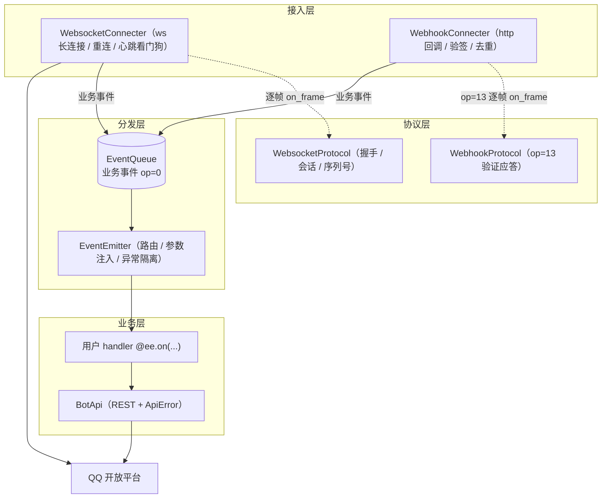

# qqbotsdk

QQ 官方机器人 Python SDK（Python 3.13 / asyncio / aiohttp），支持 WebSocket 与 Webhook 两种接入方式。

[使用指南](docs/GUIDE.md) · [API 参考](docs/API.md) · [架构](docs/ARCHITECTURE.md) · [示例](examples/) · [更新日志](CHANGELOG.md)

## 架构



组件在 `run_loop` 显式装配，并按类型登记到 `emitter.services` 供 handler 参数注入（无全局单例）；协议帧由连接适配器交给各自的协议处理器就地处理，只有 op=0 的业务事件经队列进入分发——依赖关系与设计决策详见 [docs/ARCHITECTURE.md](docs/ARCHITECTURE.md)。

## 特性

- 内置协议处理器（`ws_protocol.py` / `webhook_protocol.py`）：HELLO 鉴权（IDENTIFY/RESUME 自动切换）、READY 会话捕获、INVALID_SESSION 会话失效处理；心跳由连接器按连接生命周期驱动
- 断线自动重连（指数退避 + 心跳看门狗），重连时自动 RESUME 续传
- Webhook 接入自带 Ed25519 验签、op=13 验证应答与 60s TTL 事件去重
- 事件订阅由项目根目录的 `intents.toml` 控制，按大类（Intents 分组）开关，将对应分组改为 `true` 即可
- Markdown 与内嵌按钮一等支持：`post_group_message(..., markdown=..., keyboard=...)` 自动置 msg_type=2，`respond_interaction()` 回应按钮回调
- 组件在 `run_loop` 显式装配（无 DI 框架依赖），全 SDK 共享一个 HTTP 连接池

## 配置

`.env`（`APPID`/`APPSECRET` 必填，缺失启动即报错）：

```ini
APPID=你的AppID
APPSECRET=你的AppSecret
BASE_URL=https://api.bot.qq.com   # 可选，默认官方地址
TIMEOUT=5000                      # 可选，毫秒
CONNECTER=websocket               # websocket 或 webhook

# 仅 webhook 接入时
WEBHOOK_HOST=0.0.0.0
WEBHOOK_PORT=8080
WEBHOOK_PATH=/qqbot/webhook
```

## 使用

编写入口（如 `main.py`），把自己构造的 `EventEmitter` 传给 `main()`：

```python
from qqbotsdk import EventEmitter, main

ee = EventEmitter()

# 方式一：裸参数（d 为原始事件数据）
@ee.on("GROUP_AT_MESSAGE_CREATE")
async def on_group_message(d):
    print("收到群消息:", d)

# 方式二：类型化 payload（dataclass，见 qqbotsdk.payloads）
from qqbotsdk.payloads import GroupAtMessage

@ee.on("GROUP_AT_MESSAGE_CREATE")
async def on_group_message(msg: GroupAtMessage):
    print(msg.group_openid, msg.user_openid, msg.content)

# 方式三：参数注入（按形参标注解析，`BotApi` 等组件由 SDK 装配）
from qqbotsdk.api import BotApi
from qqbotsdk.events import Event

@ee.on("GROUP_AT_MESSAGE_CREATE")
async def handle(event: Event, api: BotApi):
    print(event.user_id, event.group_id, event.content)
    # 被动回复：带 msg_id（群聊 5 分钟/单聊 60 分钟内有效，最多分别回复 5/4 次）；
    # 同一条消息多次回复递增 msg_seq
    await api.post_group_message(
        event.group_id,
        content=f"你说：{event.content}",
        msg_id=event.message_id,
    )   # 失败抛 ApiError；富媒体先 upload_group_file 拿 file_info

# 业务事件（op=0）才进分发，返回值不回流，回复请显式调 BotApi；
# 协议帧（HELLO/READY/INVALID_SESSION/op=13）由各接入方式的协议处理器
# 在连接器内就地处理，不进队列、也不会触达 handler。
# 单个 handler 抛异常不会影响其他 handler 和主循环，异常会被记录。

if __name__ == "__main__":
    main(ee)
```

运行：

```bash
uv run python main.py
```

Webhook 接入：将 `.env` 中 `CONNECTER` 改为 `webhook`，运行后把
`http://<你的域名>:8080/qqbot/webhook` 配置到 QQ 开放平台回调地址（仅支持 80/443/8080/8443 端口，需公网 HTTPS）。

完整可运行示例见 [examples/](examples/)：群机器人（文本/图片回复、入群欢迎、单聊回复）与 Webhook 最小接入。

## 开发

```bash
uv run pytest    # 单元测试
uv run ruff check src tests examples && uv run pyright
```

文档站点基于 [docsify](https://docsify.js.org/)（无需构建，仓库根 `index.html` + Markdown），本地预览：

```bash
npx docsify-cli serve    # 打开 http://localhost:3000
```

## 待完善

- 更多 OpenAPI 封装（按需在 `api.py` 的 `BotApi` 上加薄封装即可）
