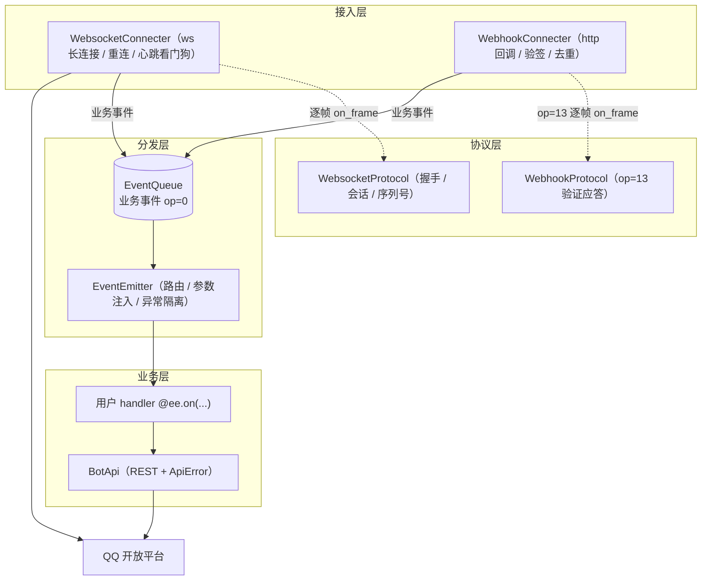

# qqbotsdk

QQ 官方机器人 Python SDK（Python 3.13 / asyncio / aiohttp），支持 WebSocket 与 Webhook 两种接入方式。

**📖 在线文档：<https://qqbotsdk.4i.hk/>**

[使用指南](docs/GUIDE.md) · [API 参考](docs/API.md) · [架构](docs/ARCHITECTURE.md) · [示例](examples/) · [更新日志](CHANGELOG.md)

## 架构



组件在 `run_loop` 中显式装配，依赖关系与设计决策详见 [docs/ARCHITECTURE.md](docs/ARCHITECTURE.md)。

## 特性

- 断线自动重连（指数退避 + 心跳看门狗），重连时自动 RESUME 续传
- Webhook 接入自带 Ed25519 验签、op=13 验证应答与事件去重
- 事件订阅由项目根目录的 `intents.toml` 按大类开关
- Markdown 与内嵌按钮一等支持，`respond_interaction()` 回应按钮回调
- 组件显式装配（无全局单例），全 SDK 共享一个 HTTP 连接池

## 配置

`.env`（`APPID`/`APPSECRET` 必填，缺失启动即报错）：

```ini
APPID=你的AppID
APPSECRET=你的AppSecret
BASE_URL=https://api.bot.qq.com   # 可选
TIMEOUT=5000                      # 可选，毫秒
CONNECTER=websocket               # websocket 或 webhook

# 仅 webhook 接入时
WEBHOOK_HOST=0.0.0.0
WEBHOOK_PORT=8080
WEBHOOK_PATH=/qqbot/webhook
```

## 使用

```python
from qqbotsdk import EventEmitter, main
from qqbotsdk.payloads import GroupAtMessage
from qqbotsdk.api import BotApi

ee = EventEmitter()

# handler 形参按标注注入 payload 与 BotApi 等组件（也支持裸参数 d）
@ee.on("GROUP_AT_MESSAGE_CREATE")
async def on_group_message(msg: GroupAtMessage, api: BotApi):
    # 被动回复带 msg_id；多次回复递增 msg_seq；失败抛 ApiError
    await api.post_group_message(
        msg.group_openid,
        content=f"你说：{msg.content}",
        msg_id=msg.id,
    )

if __name__ == "__main__":
    main(ee)
```

运行：

```bash
uv run python main.py
```

Webhook 接入：`.env` 中 `CONNECTER` 改为 `webhook`，再把回调地址配置到 QQ 开放平台（仅支持 80/443/8080/8443 端口，需公网 HTTPS）。

完整示例见 [examples/](examples/)，更多写法见[使用指南](docs/GUIDE.md)。

## 开发

```bash
uv run pytest    # 单元测试
uv run ruff check src tests examples && uv run pyright
```

推送与 Pull Request 由 GitHub Actions 自动执行同样的检查（[.github/workflows/ci.yml](.github/workflows/ci.yml)）。

文档站点基于 [docsify](https://docsify.js.org/)，文档变更时自动发布（[.github/workflows/deploy-docs.yml](.github/workflows/deploy-docs.yml)）；本地预览：

```bash
npx docsify-cli serve
```

## 待完善

- 更多 OpenAPI 封装（按需在 `api.py` 的 `BotApi` 上加薄封装即可）
