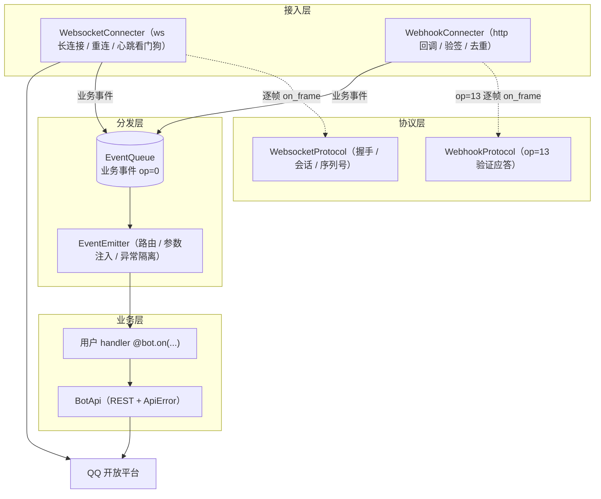

# qqbotsdk

[](https://github.com/snowy-yang/qqbotsdk/actions/workflows/ci.yml)
[](https://pypi.org/project/qqbotsdk-py/)
[](https://pypi.org/project/qqbotsdk-py/)
[](https://pypistats.org/packages/qqbotsdk-py)
[](LICENSE)

QQ 官方机器人 Python SDK（Python 3.12+ / asyncio / aiohttp），支持 WebSocket 与 Webhook 两种接入方式。

**📖 在线文档：<https://qqbotsdk.4i.hk/>**

[快速开始](docs/guide/start.md) · [使用指南](docs/guide/handlers.md) · [API 参考](docs/api/core.md) · [架构](docs/ARCHITECTURE.md) · [示例](examples/) · [更新日志](CHANGELOG.md)

## 安装

```bash
pip install qqbotsdk-py     # 或 uv add qqbotsdk-py
```

## 五分钟上手

`.env` 配好 `APPID`/`APPSECRET`，`intents.toml` 开启 `GROUP_AND_C2C_EVENT = true`：

```python
from qqbotsdk import Bot
from qqbotsdk.api import BotApi
from qqbotsdk.payloads import GroupAtMessage

bot = Bot()


# handler 形参按标注注入 payload 与 BotApi 等组件
@bot.on("GROUP_AT_MESSAGE_CREATE")
async def on_group_message(msg: GroupAtMessage, api: BotApi):
    # 被动回复带 msg_id（5 分钟内有效，多次回复递增 msg_seq）；失败抛 ApiError
    await api.post_group_message(
        msg.group_openid,
        content=f"你说：{msg.content}",
        msg_id=msg.id,
    )


if __name__ == "__main__":
    bot.run()
```

Webhook 接入：`.env` 中 `CONNECTER` 改为 `webhook`，再把回调地址配置到 QQ 开放平台（仅支持 80/443/8080/8443 端口，需公网 HTTPS），handler 写法完全一致。

## 特性

- `Bot` 门面：`bot.run()` 一行启动，`bot.call_api` 通用 REST，`bot.api` 类型化 API 面
- 断线自动重连（指数退避 + 心跳看门狗），重连时自动 RESUME 续传
- Webhook 接入自带 Ed25519 验签、op=13 验证应答与事件去重
- 事件订阅由项目根目录的 `intents.toml` 按大类开关
- Markdown 与内嵌按钮一等支持，`respond_interaction()` 回应按钮回调
- 组件按类型注入 handler（自定义组件同样可注入），全 SDK 共享一个 HTTP 连接池

## 架构


```mermaid
flowchart TB
    subgraph 接入层
        WS["WebsocketConnecter（ws 长连接 / 重连 / 心跳看门狗）"]
        WH["WebhookConnecter（http 回调 / 验签 / 去重）"]
    end
    subgraph 协议层
        WSP["WebsocketProtocol（握手 / 会话 / 序列号）"]
        WHP["WebhookProtocol（op=13 验证应答）"]
    end
    subgraph 分发层
        Q[("EventQueue<br/>业务事件 op=0")]
        EE["EventEmitter（路由 / 参数注入 / 异常隔离）"]
    end
    subgraph 业务层
        API["BotApi（REST + ApiError）"]
        USER["用户 handler @bot.on(...)"]
    end
    QQ["QQ 开放平台"]

    WS -. "逐帧 on_frame" .-> WSP
    WH -. "op=13 逐帧 on_frame" .-> WHP
    WS -->|"业务事件"| Q
    WH -->|"业务事件"| Q
    Q --> EE
    EE --> USER
    USER --> API
    API --> QQ
    WS --> QQ
```

组件在 `Bot.start()` 中装配，依赖关系与设计决策详见 [docs/ARCHITECTURE.md](docs/ARCHITECTURE.md)。

## 开发

```bash
uv run pytest    # 单元测试
uv run ruff check src tests examples && uv run pyright
```

推送与 Pull Request 由 GitHub Actions 自动执行同样的检查（[.github/workflows/ci.yml](.github/workflows/ci.yml)）；打 `v*` 标签经 [publish.yml](.github/workflows/publish.yml) 以 Trusted Publishing 发布到 PyPI。

文档站点基于 [docsify](https://docsify.js.org/)，文档变更时自动部署到 GitHub Pages（[.github/workflows/pages.yml](.github/workflows/pages.yml)，自定义域名 qqbotsdk.4i.hk）；本地预览：

```bash
npx docsify-cli serve
```
