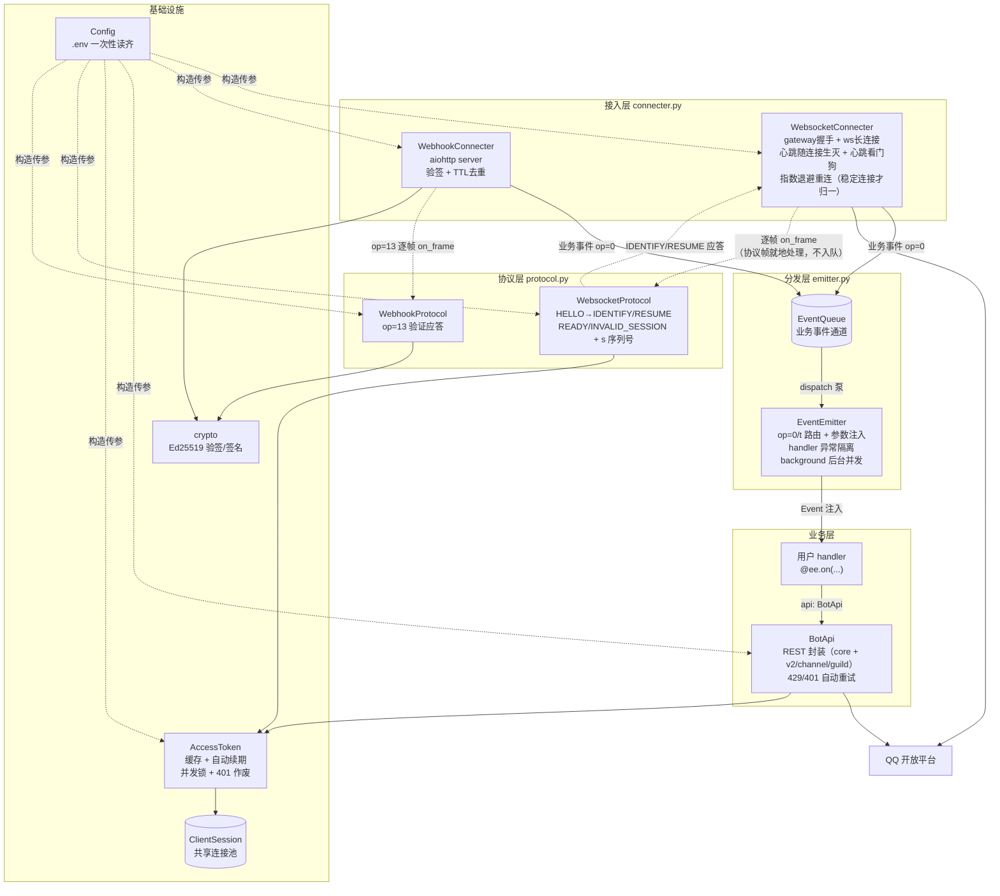
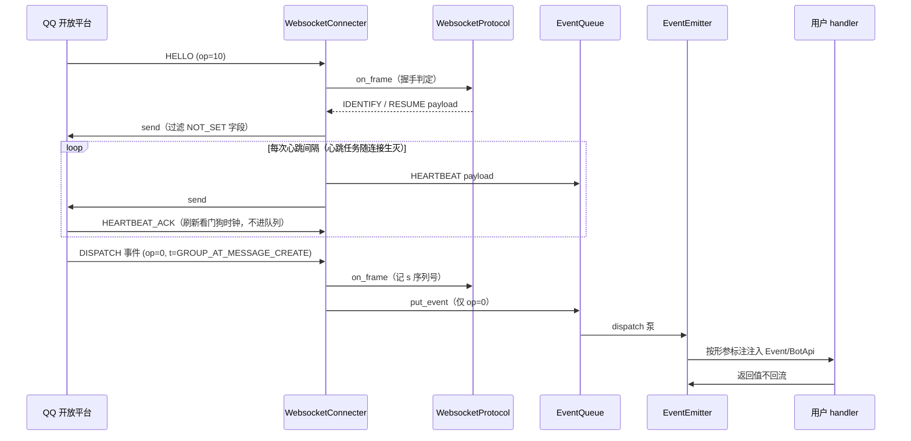

# qqbotsdk 架构

本文描述 SDK 的分层结构、数据流与扩展点。阅读对象：维护者与想深入定制的使用者。

## 总览

## 数据流（WebSocket 接入为例）

## 分层规则

依赖方向自上而下，下层不认识上层：

| 层 | 模块 | 职责 | 不允许出现 |
|---|---|---|---|
| 接入层 | `connecter.py` | 传输细节：握手、心跳、重连、验签、去重；逐帧驱动协议处理器 | 事件业务语义、协议状态机 |
| 协议层 | `protocol.py` `ws_protocol.py` `webhook_protocol.py` | 适配器专有的协议处理（`BaseProtocol.on_frame`）：鉴权/验证/会话语义 | 传输细节、业务语义 |
| 分发层 | `emitter.py` | 只分发业务事件（op=0）：路由、参数注入、异常隔离、后台并发 | 传输细节、协议帧、协议状态机 |
| 业务层 | `api/` `payloads.py` + 用户代码 | OpenAPI 调用、payload 解析与机器人逻辑 | 协议细节 |

跨层共享的最小公共物：`model.py`（Opcode/Payload/Intent）、`protocol.py`（协议处理器接口，被接入层与协议层共同依赖）、`queue.py`（事件通道）、`config.py`、`session.py`（ws 会话状态）、`payloads.py`（事件 dataclass 与解析，被 `events.py`/`emitter.py` 使用）。

## 生命周期与依赖装配

- 全部组件在 `run_loop`（`__init__.py`）显式构造装配，无 DI 框架，也无任何全局单例。
- 组件按类型登记进 `emitter.services`，handler 形参标注类型即得实例；用户自定义组件同样登记即可注入。
- 唯一的 `ClientSession` 在 `run_loop` 构造，`finally` 中先 `emitter.close()` 收尾后台 handler、再统一释放连接池（全 SDK 共享一个连接池）。
- 接入方式的选择收敛在 `run_loop` 的 `match config.connecter` 装配分支：每种接入方式构造**自己的协议处理器**并注入对应的 connecter（主体不再持有协议层）；`WebhookConnecter` 经协议处理器的 `on_frame` 就地取得 op=13 应答，不感知 `EventEmitter`。两个 connecter 的依赖面一致（config + queue + 各自所需的窄依赖 + `BaseProtocol`）。
- 用户在 `main(ee)` 之前构造的 `EventEmitter` 会被复用（连同它的队列），保证 handler 注册在主体实际使用的实例上。

## 关键设计决策

1. **业务事件走管线，协议帧走专有处理器**：只有 op=0 的业务事件经 `EventQueue` 异步流转给 `EventEmitter` 分发；HELLO/READY/INVALID_SESSION/op=13 等协议帧由 connecter 逐帧调用其专有协议处理器（`BaseProtocol.on_frame`）就地处理。这样用户 handler 不会看到协议帧，且"断线前重置会话"这类时序不再取决于分发泵的进度——`INVALID_SESSION` 的会话清空在 connecter `break` 重连前已同步完成，不会误 RESUME 一个已死会话。代价是多一跳队列延迟（可忽略）。
2. **协议层只管会话语义，心跳归传输层**：`WebsocketProtocol` 负责 IDENTIFY/RESUME/序列号（说什么），`WebsocketConnecter` 负责连接与心跳（怎么保活）——心跳任务随连接生灭（HELLO 给出间隔后启动，断线即取消），断线期间不在出站缓冲堆积过期心跳，也免去了调度器的生命周期管理。协议处理器的应答经 `on_frame` 返回值交给 connecter：ws 与心跳一起进 connecter 私有的出站缓冲、由单任务发送（维持 ws 单写者不变量），webhook 则直接写进 HTTP 响应体。
3. **看门狗两层互补 + 连接寿命主动重连**（见 `connecter.py` 模块注释）：静默超时抓连接彻底失联，ACK 期限检查抓"有事件流但心跳已死"。阈值 `_SILENCE_FACTOR=1.1`、`_ACK_FACTOR=1.2` 是按 ACK 自然节奏校准的，**不能压到 1× 整**，否则正常抖动会周期性误杀（误杀由 RESUME 兜底，不丢消息）。重连退避只在连接稳定存活（`_STABLE_SECONDS`）后才归一，抖动的服务端不会被 1s 间隔反复探测。此外服务端约 1 小时会**无预警**断开连接（实测），故连接存活到 `_SERVER_LIFETIME - _RECONNECT_MARGIN`（默认 50 分钟）时 SDK 主动收尾重连——收帧超时取"静默阈值"与"寿命余量"两个截止中的先到者，静默仍交给看门狗，寿命到点则正常结束本轮连接、由 `run()` 判定为健康断开后立刻 RESUME 续传。
4. **handler 异常就地隔离**：`_invoke` 捕获记日志，`dispatch` 主循环另有兜底；单条事件的单个 handler 失败不影响进程。`background=True` 的 handler 进后台任务（emit 不等它），任务由 emitter 持强引用、`close()` 统一取消。
5. **注入约定**：handler 参数按形参标注解析——`payloads.py` 里的 dataclass → 解析后的 payload 对象；`Event` → 事件封装；登记进 `emitter.services` 的组件类型（如 `BotApi`）→ 实例；无标注或标注三者皆非 → 抛 `ValueError`（原始数据不注入，需要时标 `Event` 自取 `.raw`/`.typed`）。解析是纯同步查表，无框架、无运行时魔法：每个 handler 的 `get_type_hints` + 形参名只解析一次并缓存，但 `services` 命中在每条事件时实时判定，保证"先注册 handler、后登记组件"的装配顺序可用（`run_loop` 在分发开始前登记全部内置组件，正常流程不会误抛）。
6. **事件注册不依赖第三方库**：`EventEmitter` 内部就是一个 `事件名 → handler 列表` 的字典，`on()` 追加、`emit()` 顺序遍历。不需要 pyee 那套 `once`/`new_listener`/错误事件机制（SDK 用不到），少一个依赖、语义也一眼可读。注册语义：同一函数对同一事件重复注册只生效一次（沿用原先 pyee 的行为），分发按注册顺序串行执行（`background=True` 的除外）。
7. **解析计划与派生密钥都预计算**：`payloads._parse_plan` 把 dataclass 的"字段名 + 是否需解析成 Author"按类缓存一次（不再每次事件重跑 `dataclasses.fields` 与联合类型解包），解析时未收录字段一律忽略——线上 payload 会带新增/未声明字段，透传会让构造报错。`crypto` 按 AppSecret 缓存派生出的 Ed25519 私钥（派生约 40µs，而每个 webhook 请求都要验签）。都是"值为输入的纯函数、结果与输入一一对应"，缓存安全且收益明确；不追求极致速度，只去掉明显的重复计算。
8. **OpenAPI 请求内核自治**：`api/core.py` 统一处理鉴权头、429 限流重试（优先 `Retry-After`，脏值容错，退避封顶）与 401 刷新 token 重试一次；v2/channel/guild 三个域方法集继承内核组合成 `BotApi`，新增域加模块即可，方法对用户始终平铺在 `BotApi` 上。

## 扩展点

- **新增接入方式**（如轮询/其他平台）：继承 `Connecter` 实现 `run()`、继承 `BaseProtocol` 实现 `on_frame()`，在 `run_loop` 的 `match` 装配分支加一个 `case`（构造该方式的协议处理器并注入 connecter），`Config.load` 的白名单加一个名字。
- **新增业务 API**：在 `api/` 对应域模块（`v2`/`channel`/`guild`）加方法即自动平铺到 `BotApi`，全部获得鉴权、限流重试与错误处理；新增域则新建模块并组合进 `api/__init__.py` 的 `BotApi`。群/单聊消息经 `_post_message` 统一处理 msg_id/msg_seq/media 语义；已有方法覆盖：单聊/群聊消息与富媒体上传、频道消息/撤回/表态、公告、精华消息、日程、禁言、频道信息查询（guild/channels/roles/member）。
- **新增事件类型 dataclass**：在 `payloads.py` 定义 dataclass 并登记 `EVENT_TYPES`，handler 即可按类型标注拿解析结果；未收录事件回退传 dict。当前已覆盖 intents.toml 的全部事件组（消息、成员变动、审核、表态、互动、论坛、音频）。

## 测试

`tests/` 覆盖：

- 纯逻辑：crypto 往返、intents 解析、Config 校验、协议帧处理（`test_route.py`：IDENTIFY/RESUME 选路、READY 捕获、s 序列号、INVALID_SESSION 重置、业务事件不产生应答）、webhook 去重（含 TTL 过期与摊还清理）、序列号单调性、handler 异常隔离、handler 注册语义（同函数重复注册只生效一次、按注册顺序执行）、payload dataclass 解析（含未收录字段忽略、解析计划缓存）、BotApi 各业务方法的拼参（Recording 子类截获 request）。
- **网络集成**（`test_ws_integration.py` / `test_webhook_integration.py`）：
  - WebSocket：aiohttp 假网关（token 接口 + gateway + ws 协议行为）端到端跑通 HELLO → IDENTIFY → READY 会话捕获 → 心跳/ACK（心跳任务随连接生灭）→ 业务事件 dataclass 分发，并断言协议帧（HELLO/HEARTBEAT_ACK）不会触达 handler；
  - Webhook：真实起 `WebhookConnecter` 的 http server（TestServer），覆盖 op=13 验证应答（签名内容正确性）、合法签名放行分发、坏签名 401、同 id 去重。

另有 429/401 重试、token 并发锁、background 后台并发与 `close()` 收尾的专项单测。两套集成测试验证的都是真实连接路径，改接入层/协议层后跑 `uv run pytest` 即可回归。
