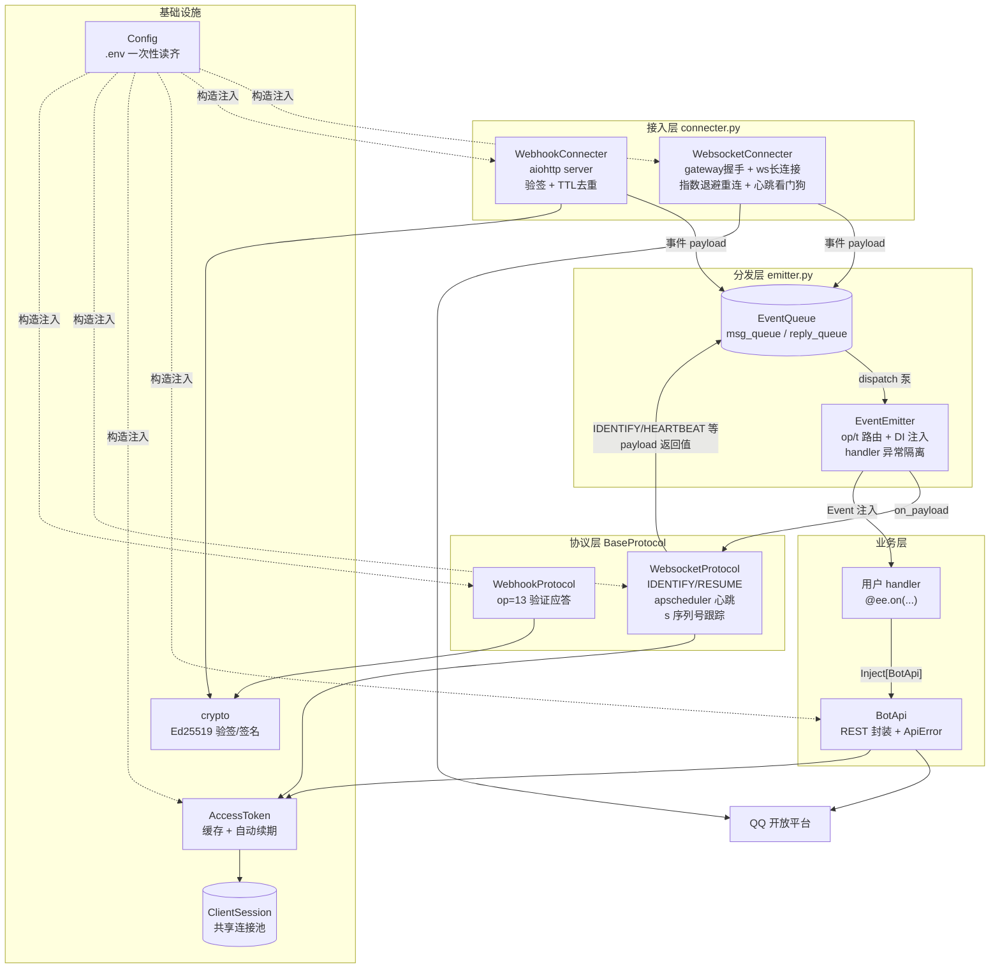
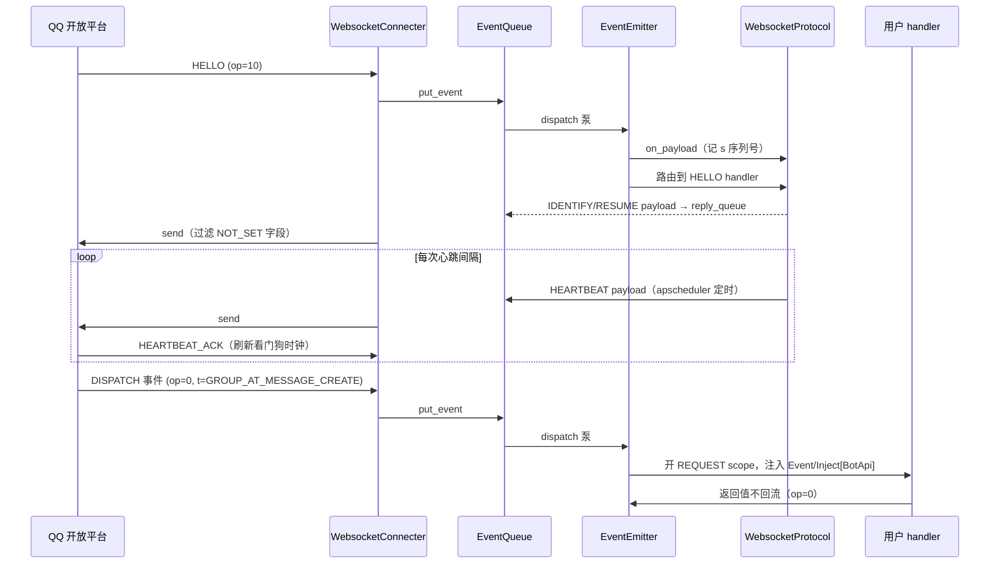

# qqbotsdk 架构

本文描述 SDK 的分层结构、数据流与扩展点。阅读对象：维护者与想深入定制的使用者。

## 总览

## 数据流（WebSocket 接入为例）

## 分层规则

依赖方向自上而下，下层不认识上层：

| 层 | 模块 | 职责 | 不允许出现 |
|---|---|---|---|
| 接入层 | `connecter.py` | 传输细节：握手、重连、验签、去重 | 事件业务语义、handler 调用 |
| 分发层 | `emitter.py` | 路由、DI 注入、异常隔离、应答回流 | 传输细节、具体协议状态机 |
| 协议层 | `ws_protocol.py` `webhook_protocol.py` | 鉴权/心跳/验证等协议状态机 | 传输细节（只经队列收发） |
| 业务层 | `api.py` `payloads.py` + 用户代码 | OpenAPI 调用、payload 解析与机器人逻辑 | 协议细节 |

跨层共享的最小公共物：`model.py`（Opcode/Payload/Intent）、`queue.py`（事件通道）、`config.py`、`session.py`（ws 会话状态）、`payloads.py`（事件 dataclass 与解析，被 `events.py`/`emitter.py` 使用）。

## 生命周期与依赖装配

- 全部组件由 dishka 以 **APP scope** 构造注入（`di.py`），无任何全局单例。
- 唯一的 `ClientSession` 以 async-generator provider 注册，`container.close()` 时统一释放。
- 接入方式的选择收敛在 `ADAPTERS` 表：`make_container()` 按 `CONNECTER` 环境变量动态 `provider.provide(实现类, provides=抽象)`，主体代码只依赖 `BaseProtocol`/`Connecter` 抽象。
- 用户在 `main(ee)` 之前构造的 `EventEmitter` 会被容器复用（连同它的队列），保证 handler 注册在主体实际使用的实例上。

## 关键设计决策

1. **管线而非回调直调**：事件一律经 `EventQueue` 异步流转，接入与分发两侧解耦——Webhook handler 里不需要知道 ws 的存在，反之亦然。代价是多一跳队列延迟（可忽略）。
2. **协议层状态机独立**（`BaseProtocol.register/on_payload`）：emitter 不认识"心跳""序列号"这些 ws 概念；协议类通过返回 payload dict 经 reply 队列外发。
3. **看门狗两层互补**（见 `connecter.py` 模块注释）：静默超时抓连接彻底失联，ACK 期限检查抓"有事件流但心跳已死"。阈值 `_SILENCE_FACTOR=1.1`、`_ACK_FACTOR=1.2` 是按 ACK 自然节奏校准的，**不能压到 1× 整**，否则正常抖动会周期性误杀（误杀由 RESUME 兜底，不丢消息）。
4. **handler 异常就地隔离**：`_invoke`/`_call_direct` 捕获记日志，`dispatch` 主循环另有兜底；单条事件的单个 handler 失败不影响进程。
5. **注入约定**：handler 参数标注 `Inject[T]`（或裸标 `Event`/`Session`/`BotApi`）→ 从 dishka scope 解析；标注 `payloads.py` 里的 dataclass 类型 → 拿到解析后的 payload 对象（无容器路径同样生效）；未标注或解析失败 → 回退传原始 `d`，保持旧处理器兼容。注意 `Inject` 不能改成 PEP 695 懒别名（`get_type_hints` 不解包）。

## 扩展点

- **新增接入方式**（如轮询/其他平台）：实现 `Connecter.run()` 与 `BaseProtocol.register()`，在 `di.ADAPTERS` 注册一行，`Config.load` 的白名单加一个名字。
- **新增业务 API**：在 `api.py` 的 `BotApi` 上加方法（或独立模块组合 `BotApi`），全部自动获得鉴权、超时与错误处理。群/单聊消息经 `_post_message` 统一处理 msg_id/msg_seq/media 语义；已有方法覆盖：单聊/群聊消息与富媒体上传、频道消息/撤回/表态、公告、精华消息、日程、禁言、频道信息查询（guild/channels/roles/member）。
- **新增事件类型 dataclass**：在 `payloads.py` 定义 dataclass 并登记 `EVENT_TYPES`，handler 即可按类型标注拿解析结果；未收录事件回退传 dict。当前已覆盖 intents.toml 的全部事件组（消息、成员变动、审核、表态、互动、论坛、音频）。

## 测试

`tests/` 覆盖：

- 纯逻辑：crypto 往返、intents 解析、Config 校验、`_route` 路由边界、webhook 去重、序列号单调性、handler 异常隔离与 reply 回流、payload dataclass 解析、BotApi 各业务方法的拼参（Recording 子类截获 request）。
- **网络集成**（`test_ws_integration.py` / `test_webhook_integration.py`）：
  - WebSocket：aiohttp 假网关（token 接口 + gateway + ws 协议行为）端到端跑通 HELLO → IDENTIFY → READY 会话捕获 → apscheduler 心跳/ACK → 业务事件 dataclass 分发；
  - Webhook：真实起 `WebhookConnecter` 的 http server（TestServer），覆盖 op=13 验证应答（签名内容正确性）、合法签名放行分发、坏签名 401、同 id 去重。

两套集成测试验证的都是真实连接路径，改接入层/协议层后跑 `uv run pytest` 即可回归。
